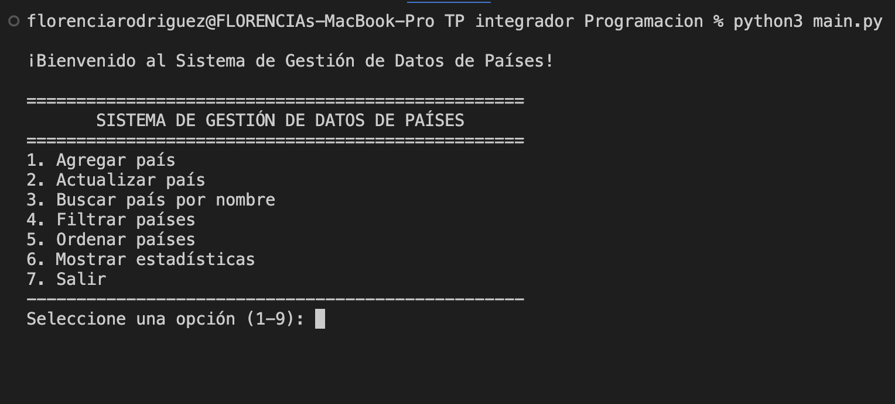
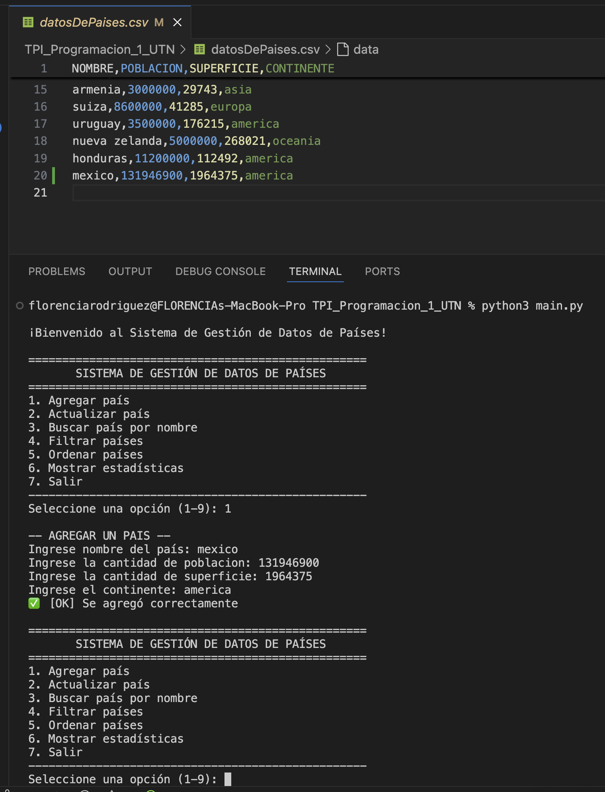
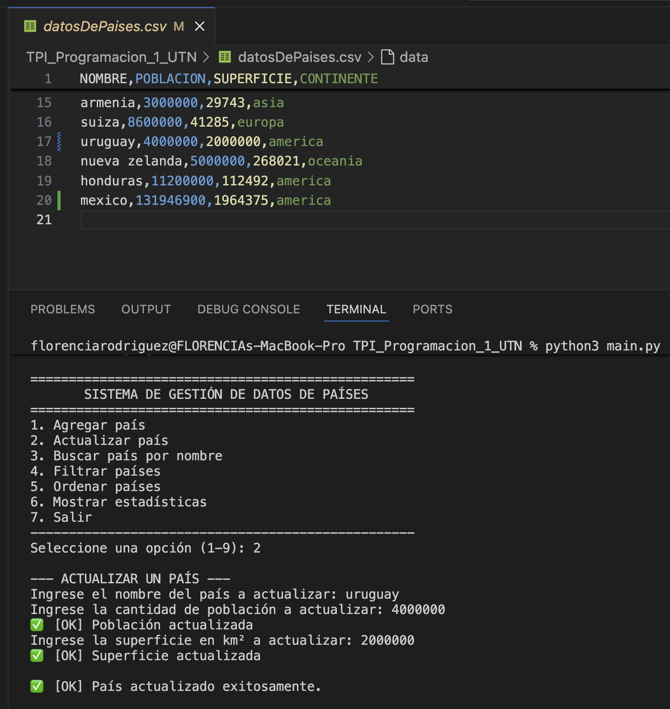
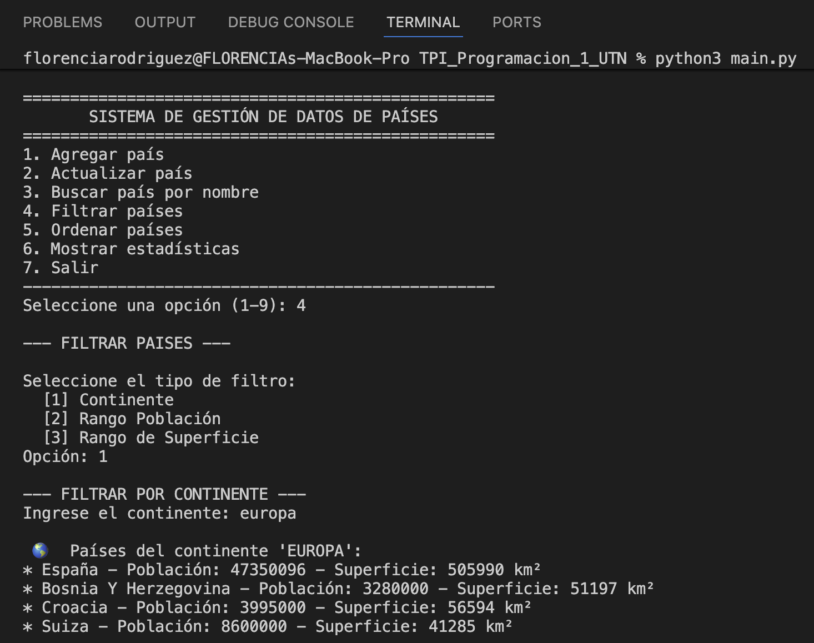
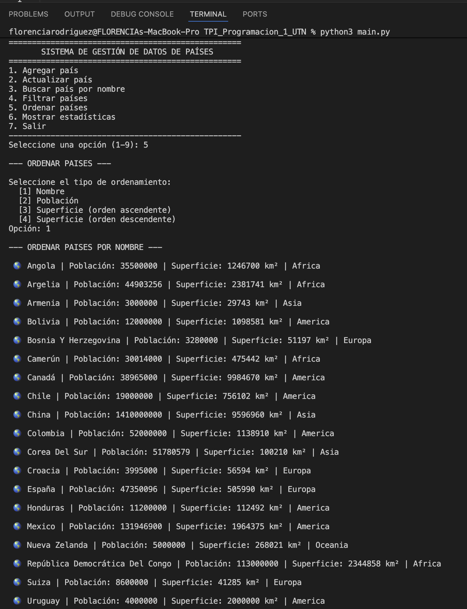
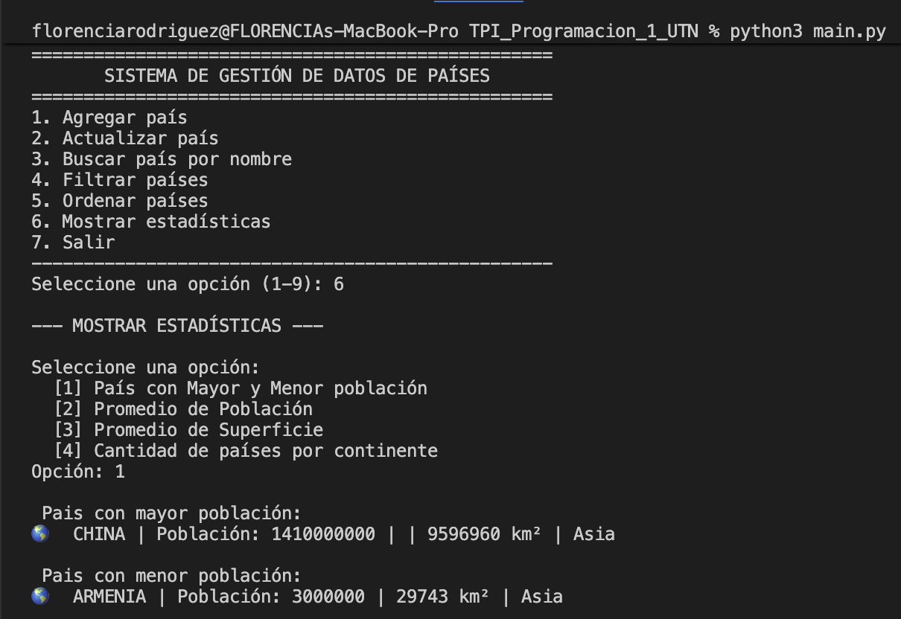
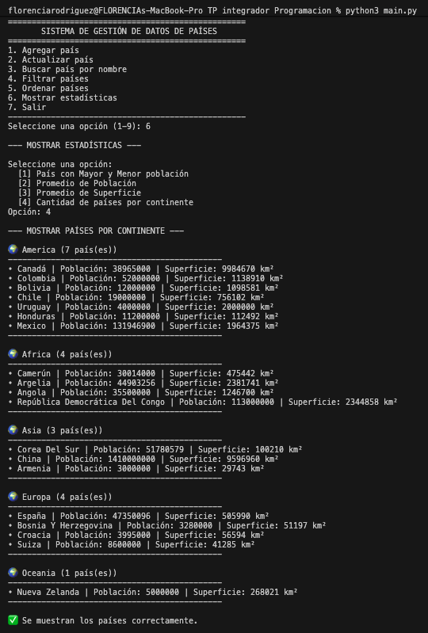

# **Trabajo Práctico Integrador de Programación I – Gestor de Datos de Países 🌍**

### 🎯 **Objetivo del Proyecto**

Desarrollar una aplicación en Python para **gestionar datos de países** mediante un **menú interactivo principal** y funciones modularizadas en cada opción del menú.
Aplicando los principales conceptos de la materia: listas, diccionarios, funciones, estructuras condicionales y repetitivas, validaciones y ordenamientos.

---

## 🏫 **Universidad Tecnológica Nacional**

### **Tecnicatura Universitaria en Programación**

### **Materia: Programación I**

### 👥 **Integrantes – Grupo 6**

- **Franco, Analía – Comisión 5**
- **Rodriguez, Florencia – Comisión 11**

---

## 📂 **Estructura del Proyecto**

| 🗃️ Archivo / Directorio | 🧾 Descripción                                                                                                 |
| ----------------------- | -------------------------------------------------------------------------------------------------------------- |
| **main.py**             | Punto de inicio del programa; contiene el menú principal y las llamadas a las distintas funciones del sistema. |
| **funciones.py**        | Contiene todas las funciones a utilizar para manipular el archivo csv como las del menú principal.             |
| **datosDePaises.csv**   | Archivo CSV con la información de los países (nombre, población, superficie, continente).                      |
| **imagenes**            | Contiene las capturas de pantalla sobre el funcionamiento de la aplicación.                                    |
| **diagramas**           | Dentro están los diagramas utilizados para la realización del sistema.                                         |
| **.gitignore**          | Define qué archivos no se subirán al repositorio.                                                              |

---

## 🖥️ **Instrucciones de ejecución**

- Se deben descargar los archivos **main.py**, **funciones.py**, **datosDePaíses.py**.
- Tener instalado **Python 3**, para ejecutarlo se debe escribir **python main.py**.
- Al ejecutar el programa, se muestra en la terminal un **menú interactivo** que persiste hasta que elija la opción **“Salir”**.

### 🔢 **Opciones del menú principal:**

1️⃣ Agregar país  
2️⃣ Actualizar país  
3️⃣ Buscar país por nombre  
4️⃣ Filtrar países  
5️⃣ Ordenar países  
6️⃣ Mostrar estadísticas  
7️⃣ Salir

  

---

Agregar y actualizar país:
  

     
  
  

---
## 🗂️ **Funcionalidades Principales**

### 🔍 **Filtrado de información**

- Filtrado por **continente**.
- Filtrado por **rango de población o superficie**.
- Devuelve una **lista con los países que cumplen las condiciones**.

  

---

### ↕️ **Ordenamiento**

- Utiliza método **'bubble sort'** para ordenar los registros.
- Permite seleccionar **orden ascendente o descendente** para la superficie.
- Criterios disponibles: **nombre**, **población** o **superficie**.
  

  

---

### 📊 **Estadísticas**

- Determina el país con **mayor** y **menor población**.
- Calcula los **promedios de superficie y continentes totales**.
- Cuenta la **cantidad de países por continente** y devuelve una lista con los valores que cumplen la condición.

País con mayor y menor población y Cantidad de países por continente:
  

    
    
  

---

### ✅ **Validaciones**

- Controla que los campos de texto no estén vacíos, en caso de ser una validación de país, verifica que todas las palabras sean alfabéticas, y que no existan nombres duplicados.
- Verifica que los valores para (población, superficie) sean válidos, es decir numéricos, positivos distintos de 0 y los convierte a `int`.
- Evita errores por **entradas inválidas o duplicadas** que puedan interrumpir la ejecución.

---

### 🗒️ **Normalización de datos**

- Uso de `.strip()` para eliminar espacios en blanco.
- Aplicación de `.title()`, `.lower()` o `.upper()` para estandarizar los nombres.
- Conversión de textos numéricos antes de realizar operaciones.

---

### 📝 **Manejo de archivo CSV**

- Realiza **lectura, escritura y guardado** de datos en formato CSV, asegurando la persistencia de la información.
- Muestra **mensajes claros** de confirmación y advertencia que guían al usuario.
- Considera **casos excepcionales**, como archivos inexistentes o con datos corruptos, evitando errores en la ejecución.

---

## 💡 **Tecnologías Utilizadas**

- 🐍 **Lenguaje:** Python 3
- 📄 **Archivos de datos:** CSV
- 🧰 **Editor recomendado:** Visual Studio Code
